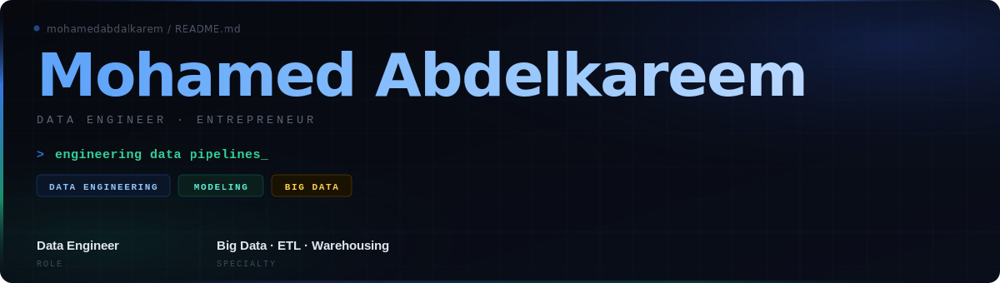

<div align="center">



</div>

---

## 🛠️ Tech Stack

| Category | Tools |
|---|---|
| **Languages** |    |
| **Big Data** |     |
| **DevOps** |     |
| **Engineering** |     |
| **Databases** |      |
| **Cloud** |   |

---

## 📊 GitHub Stats

<div align="center">


</div>

---

## 🤝 Connect With Me

<div align="center">

[](https://wa.me/201012390457)
[](https://x.com/Mohammed285239)
[](https://www.linkedin.com/in/mohammed-abdalkareem-26297b236)
[](mailto:mohamedabdalkareem976@gmail.com)

</div>

---

<div align="center">

```
// always building  ·  always learning  ·  always shipping
```


</div>


